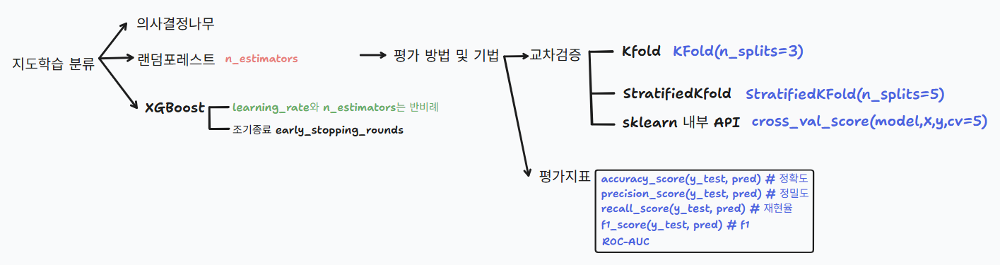
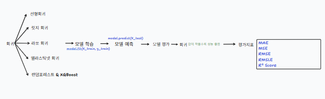
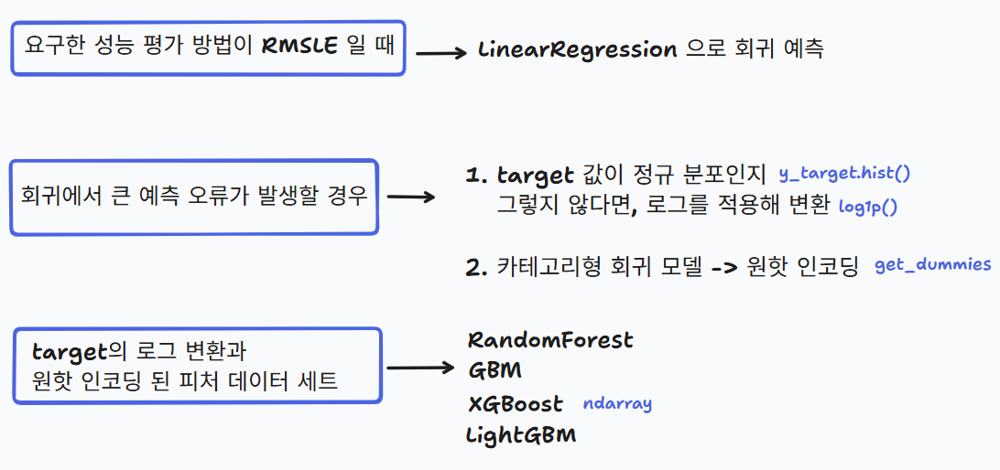
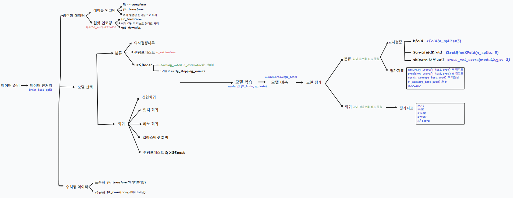
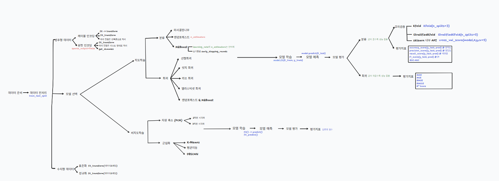

# ML(Machine Learning)

This repository contains practical exercises and mini-projects related to machine learning.

## 📂 Structure

### 📂**ML**/NLP

---

Exercises focused on NLP in machine learning.

- **ML_Day10**: Performed sentiment analysis using `KoNLPy`, CountVectorizer, TfidfVectorizer, and Naver movie review API.

  

  

### 📂**ML**/Supervised Learning

---

​	📂**ML Practice/**  
​		Exercises focused on supervised learning in machine learning.

- **ML_Day1**: `Data Visualization` using the Titanic dataset.

- **ML_Day2**: Overview of the `Machine Learning` workflow.

  

- **ML_Day3**: `Supervised learning` (classification), cross-validation, and evaluation with hands-on modeling.

  

- **ML Day4**: Trained and evaluated classification models on the `Kaggle Santander Customer Satisfaction` dataset to find the best-performing model.
- **ML Day6**: `Supervised learning` (regression), linear, ridge, lasso and elastic net regression with hyperparameter tuning, ensemble models, and evaluation metrics.

- **ML Day7**: Trained and evaluated regression models on the `Kaggle Bike Sharing Demand` dataset to find the best-performing model.

  

  

​	📁 **ML Project/**  
​		Projects that apply machine learning techniques to real-world datasets.  

- **Kaggle Credit Card Fraud Detection Project**(ML_Day5): Participated in Kaggle’s Credit Card Fraud Detection competition using `classification models.`
- **Kaggle House Prices Project**(ML_Day8): Participated in Kaggle’s House Prices competition using `regression models.`

  

### 📂**ML**/Time Series

---

​	📂**TS Practice/** 

​	Hands-on practice working with time series data.

- **TS Day1**: Characteristics of `time series data`, Smoothing, Time series data EDA, Autocorrelation
- **TS Day2**: Practiced transforming non-stationary data into `stationary` by applying log transformation to stabilize variance, differencing to remove trend, and seasonal differencing to remove seasonality.
- **Time Series Mini Project (TS_Day2)**: Built a prediction model using robot error detection data based on TS Day2 learnings as a mini project.
- **Time Series Mini Project (TS_Day3)**: Practiced transforming non-stationary data into stationary by applying log transformation, differencing, and seasonal differencing using `auto-ARIMA`.
- **Time Series Mini Project (TS_Day4)**: Practiced `Dickey-Fuller Test`, easy stationarity transformation using `time series decomposition`, and ARIMA modeling.

​	📂**TS Project/** 

​	Built and predicted using forecasting models based on time series data.

- **TS_Day2_Practice and Project**: Combined TS Day2 and Time Series Mini Project (TS Day2).

  

###  📂**ML**/Unsupervised Learning

---

Exercises focused on unsupervised learning in machine learning.

- **ML_Day9**: Dimensionality reduction (`PCA`), 2D/3D visualization, KMeans `clustering`, dendrograms.

  

  

---

## ✨ Skills Covered

**🛠️ Tech Stack**  
Jupyter Notebook, tldraw(schematic tool), google colab

  

📊 **Techniques - ML, NLP**  

- **Data Preprocessing**

  Label Encoding, One-Hot Encoding, Standardization, Normalization, PCA, KoNLPy, CountVectorizer, TfidfVectorizer

- **Model Selection**

  Classification, Regression, Clustering, KMeans, Mean Shift, DBSCAN, GMM

- **Model Training**

  decesion tree, randomforest, XGBoost, linear, ridge, lasso, elastic net, ensemble, hyper-parameter tuning(GridSearchCV, RandomizedSearchCV, Stacking, fit_predict()

- **Model Prediction** 

- **Model Evaluation**

  KFold, StratifiedKFold, accuracy_score, precision, recall, F1, ROC-AUC, MAE, MSE, RMSE, RMSLE, R² SCORE, Dendrogram, Silhouette Score

  

📊 **Techniques - Time Series**

- **Stationarity Check**
   Moving Average, Moving Standard Deviation Visualization

- **Non-Stationary to Stationary Transformation**
   Log Transformation (to stabilize variance), Differencing (to remove trend), Seasonal Differencing (to remove seasonality), Time Series Decomposition

- **Statistical Testing**
   Dickey-Fuller Test

- **ARIMA Parameter Selection**
   ACF (Autocorrelation Function), PACF (Partial Autocorrelation Function) → Determine p, d, q

- **Model Evaluation**
   Residual Diagnostics, Forecast Accuracy Testing

