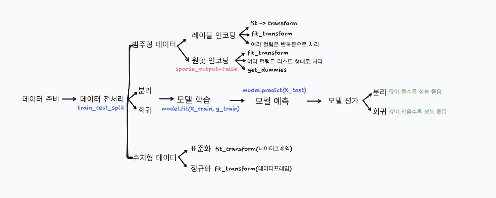
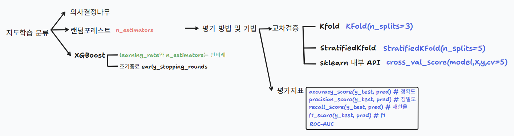
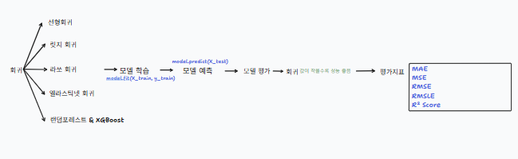
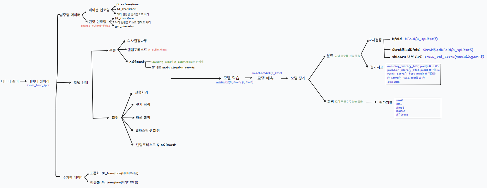

# ML(Machine Learning)

This repository contains practical exercises and mini-projects related to machine learning.

## 📂 Structure

### 📂**ML**/

---

​	📂**ML Practice/**  
​		Exercises focused on machine learning techniques.  

- **ML_Day1**: `Data Visualization` using the Titanic dataset.

- **ML_Day2**: Overview of the `Machine Learning` workflow.

  

  

- **ML_Day3**: `Supervised learning` (classification), cross-validation, and evaluation with hands-on modeling.

  

- **ML Day4**: Trained and evaluated classification models on the `Kaggle Santander Customer Satisfaction` dataset to find the best-performing model.
- **ML Day6**: `Supervised learning` (regression), linear, ridge, lasso and elastic net regression with hyperparameter tuning, ensemble models, and evaluation metrics.

- **ML Day7**: Trained and evaluated regression models on the `Kaggle Bike Sharing Demand` dataset to find the best-performing model.

  

  

​	📁 **ML Project/**  
​		Projects that apply machine learning techniques to real-world datasets.  

- **Kaggle Credit Card Fraud Detection Project**(ML_Day5): Participated in Kaggle’s Credit Card Fraud Detection competition using `classification models.`
- **Kaggle House Prices Project**(ML_Day8): Participated in Kaggle’s House Prices competition using `regression models.`

---

## ✨ Skills Covered

**🛠️ Tech Stack**  
Jupyter Notebook, tldraw(schematic tool)

📊 **Techniques**  

- **Data Preprocessing** (Label Encoding, One-Hot Encoding, Standardization, Normalization) 
- **Model Selection** (Classification, Regression)
- **Model Training** (decesion tree, randomforest, XGBoost, linear, ridge, lasso, elastic net, ensemble, hyper-parameter tuning(GridSearchCV, RandomizedSearchCV)
- **Model Prediction** 
- **Model Evaluation** (KFold, StratifiedKFold, accuracy_score, precision, recall, F1, ROC-AUC, MAE, MSE, RMSE, RMSLE, R² SCORE)

